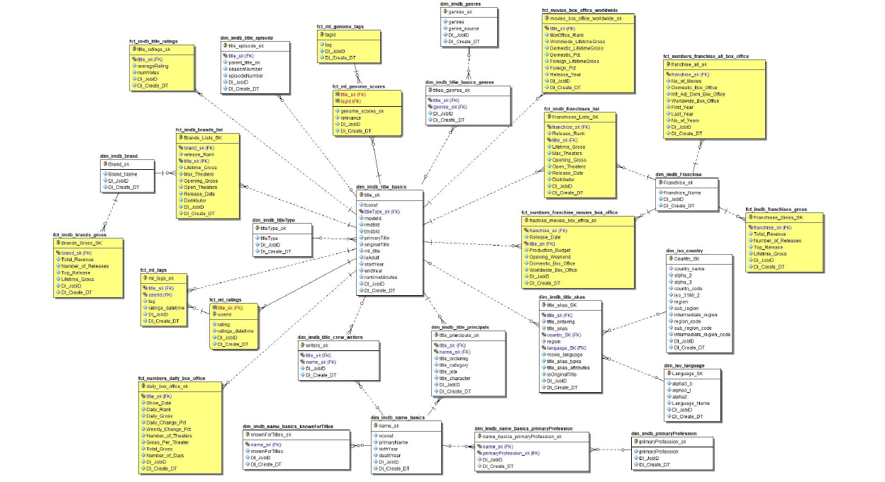

# IMDB-Data-Warehouse-Management-and-Business-Intelligence

Approach followed while implementing this project:

 - Ingest initial set of tsv or csv files into staging tables
 - Designed and loaded dimensional model for above data
 
 
 
 - Perform data consistency & cleansing processes
 For Example: Empty values in ingestion files need to result in SQL Server column Nulls and Data type conversions
 
 - Add supplemental data to model
 - Design and create BI visualizations answering business questions
 
 
